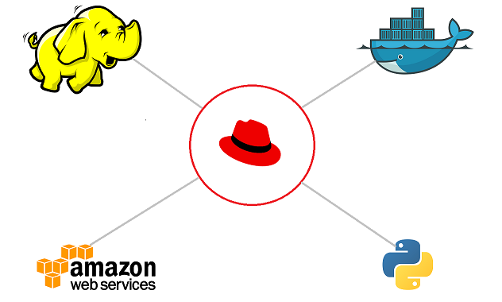
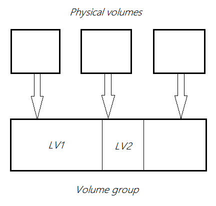
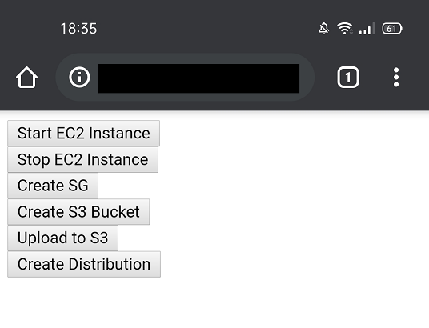
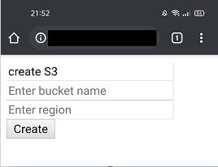
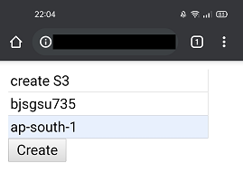
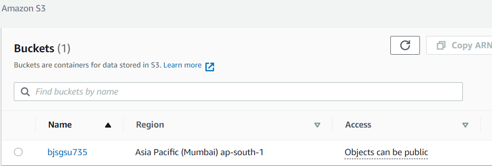

 
# Web-Menu
A Webapp that is hosted on a Apache HTTPD server and gives functionality to automate Hadoop-clustering , Docker configuration and automating AWS services. Commands can be spoken or typed in the specific fields. For some commands Ansible has been used.
It provides facility of Logical Volume Management (LVM) for providing elasticity to datanodes.




# Configuring Apache httpd server

The Apache HTTP Server, colloquially called Apache, is a free and open-source cross-platform web server software, released under the terms of Apache License 2.0. 

## Installation (RHEL7 and above)

The following commands are for installing httpd , checking status of httpd , to enable httpd ,to start the server and to stop the server respectively. 
```
yum install httpd 

systemctl status httpd
systemctl enable htpd
systemctl start httpd   
systemctl stop httpd
```

As the automation program is a long process , so the server will throw **Gateway Timeout error** . Just add the line `TimeOut 6000` anywhere in the hadoop configuration file ie. ,
`etc/hadoop/conf/hadoop.conf`

## Hadoop Automation

Apache Hadoop is a collection of open-source software utilities that facilitates using a network of many computers to solve problems involving massive amounts of data and computation. It provides a software framework for distributed storage and processing of big data using the MapReduce programming model.
Hadoop requires jdk 
The webapp installs jdk and hadoop by - 

```
sudo /usr/local/bin/ansible all -m command -a"rpm -i jdk-8u171-linux-x64.rpm"
sudo /usr/local/bin/ansible all -m command -a"rpm -i hadoop-1.2.1-1.x86_64.rpm --force"
```

By default apache does not have permission for writing to a file. In that case make apache owner of that file-

```chown apache file_path```

### Logical Volume Management (LVM)

This concept is very helpful in scenarios where dynamic rezising of volume is required. Volume can be incresed or decresed on the fly. Steps that Web-Menu uses to do this is.


# Automating AWS Services

Amazon Web Services is a subsidiary of Amazon providing on-demand cloud computing platforms and APIs to individuals, companies, and governments, on a metered pay-as-you-go basis.

## Installing aws-cli 

for Linux x86(64-bit)

```
curl "https://awscli.amazonaws.com/awscli-exe-linux-x86_64.zip" -o "awscliv2.zip"
unzip awscliv2.zip
sudo ./aws/install
```
For more details and for getting specific version refer to - [AWS Installation Guide](https://docs.aws.amazon.com/cli/latest/userguide/install-cliv2-linux.html)

for using any of the functionality, login inside your account using IAM user id and key 

```
aws configure
```
This web-app can start and stop EC2 instance , create security groups , create S3 bucket and create distribution for using CDN.



Example lets's create a S3 bucket for object type storage-

 



# Docker automation

Docker is a set of platform as a service products that use OS-level virtualization to deliver software in packages called containers. Containers are isolated from one another and bundle their own software, libraries and configuration files; they can communicate with each other through well-defined channels.

## Installing docker

open the file **/etc/yum.repos.d** , make a new file with extension **.repo** and configure the file as-

```
[tag_name]
baseurl=https://download.docker.com/linux/centos/7/x86_64/stable/
gpgcheck=0
```
Install by-

```
yum install docker-ce --nobest
```
for getting information about available containers for docker visit [Docker Hub](https://hub.docker.com/search?q=&type=image):whale:


