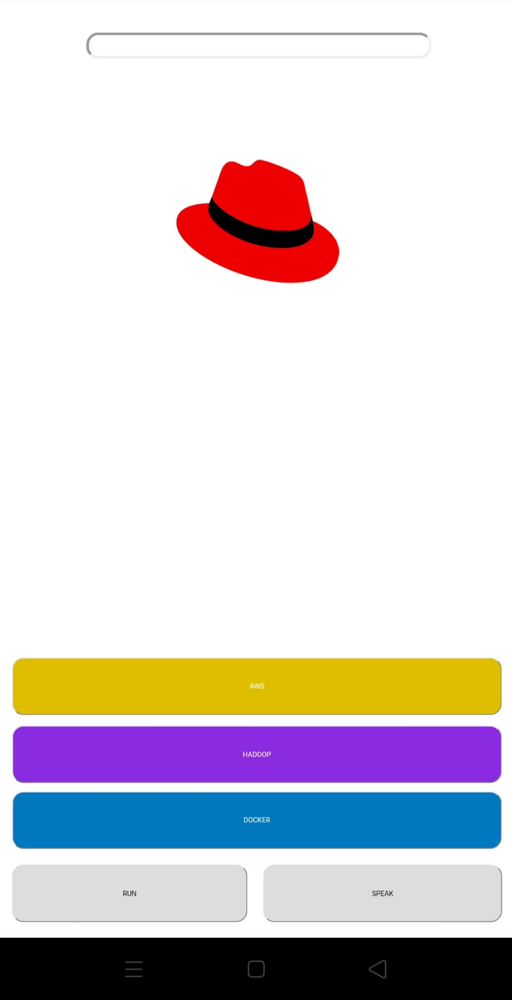

 
# Web-Menu
A Webapp that is hosted on a Apache HTTPD server and gives functionality to automate Hadoop-clustering , Docker configuration and AWS. Commands can be spoken or typed in the specific fields. For some commands Ansible has been used.
It provides facility of Logical Volume Management (LVM) for providing elasticity to datanodes.

